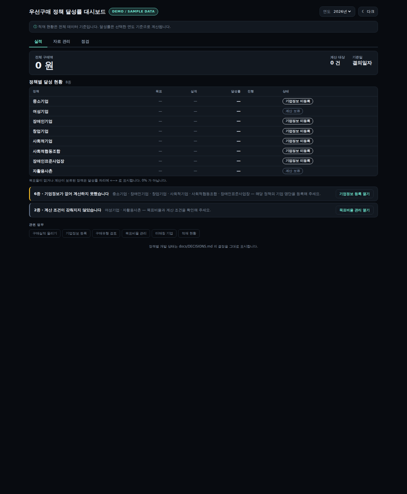
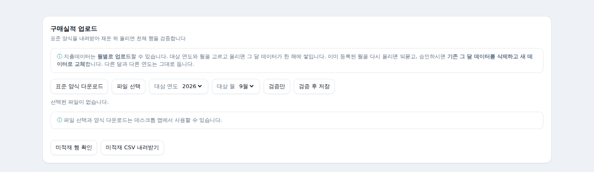
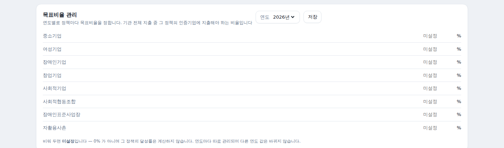
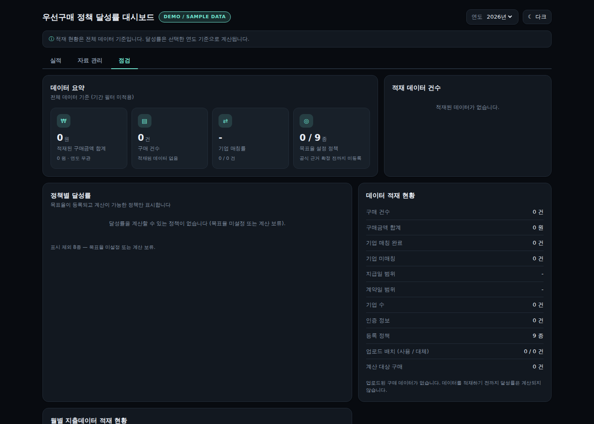

<div align="center">
<h1>공공구매정책관리시스템</h1>
<h2>사용자 매뉴얼</h2>
<p><b>버전 0.1.0</b></p>
<p>공공기관 우선구매 정책 달성률 관리</p>
</div>

---

## 목차

| 장 | 제목 |
|---|---|
| 1 | [이 시스템은 무엇을 하나요](#1-이-시스템은-무엇을-하나요) |
| 2 | [사용 전 준비](#2-사용-전-준비) |
| 3 | [프로그램 설치](#3-프로그램-설치) |
| 4 | [프로그램 실행](#4-프로그램-실행) |
| 5 | [화면 구성](#5-화면-구성) |
| 6 | [업무 순서 한눈에 보기](#6-업무-순서-한눈에-보기) |
| 7 | [구매실적 자료 올리기](#7-구매실적-자료-올리기) |
| 8 | [기업정보 등록하기](#8-기업정보-등록하기) |
| 9 | [목표비율 관리](#9-목표비율-관리) |
| 10 | [구매유형 검토](#10-구매유형-검토) |
| 11 | [실적 화면 보기](#11-실적-화면-보기) |
| 12 | [상태값 이해하기](#12-상태값-이해하기) |
| 13 | [점검 화면](#13-점검-화면) |
| 14 | [자료를 다시 올릴 때](#14-자료를-다시-올릴-때) |
| 15 | [자주 생기는 문제와 해결](#15-자주-생기는-문제와-해결) |
| 16 | [담당자 체크리스트](#16-담당자-체크리스트) |
| 17 | [프로그램 삭제와 재설치](#17-프로그램-삭제와-재설치) |
| 18 | [문의할 때 알려 주실 것](#18-문의할-때-알려-주실-것) |

---

# 1. 이 시스템은 무엇을 하나요

기관이 한 해 동안 구매한 내역과 우선구매 대상 기업 명단을 맞대어 보고,
**정책별로 얼마나 달성했는지**를 계산합니다.

## 하는 일

| | |
|---|---|
| **자료를 받습니다** | 지출 내역과 기업 명단을 엑셀로 올립니다 |
| **맞대어 봅니다** | 사업자등록번호로 두 자료를 연결합니다 |
| **계산합니다** | 정책마다 목표 대비 실적을 냅니다 |
| **알려 줍니다** | 부족한 정책과 확인이 필요한 것을 표시합니다 |

## 다루는 정책 8종

중소기업 · 여성기업 · 장애인기업 · 창업기업 · 사회적기업 ·
사회적협동조합 · 장애인표준사업장 · 국가유공자자활용사촌

## ⚠️ 먼저 알아 두실 것

> **하나의 구매가 여러 정책에 함께 들어갑니다.**
> 어떤 기업이 여성기업이면서 중소기업이면, 그 거래는 두 정책 모두에
> 실적으로 잡힙니다. 정책끼리 나눠 갖는 것이 아닙니다.

> **시스템이 업무 판단을 대신하지 않습니다.**
> 자료가 없거나 확인되지 않은 것은 «계산 보류» · «조회불가» 로 두고,
> 임의로 0% 라고 하지 않습니다. 12장에서 자세히 설명합니다.

---

# 2. 사용 전 준비

## 컴퓨터

| 항목 | 필요한 것 |
|---|---|
| 운영체제 | Windows 10 이상 |
| 여유 공간 | 500MB 이상 |
| 인터넷 | 필요 없습니다 (파일 업로드 방식으로 쓸 때) |
| 별도 설치 | 없습니다 |

> 프로그램 안에 필요한 것이 모두 들어 있습니다.
> 다른 프로그램을 미리 깔아 두지 않으셔도 됩니다.

## 자료

| 자료 | 어디서 | 언제 |
|---|---|---|
| 지출 내역 | 기관 회계 시스템 | 매월 |
| 기업 명단 | 정책별 발급기관 | 명단이 갱신될 때 |

두 자료 모두 **엑셀 파일(.xlsx)** 이어야 합니다.

> ⚠️ 오래된 `.xls` 형식은 읽지 못합니다.
> 엑셀에서 **다른 이름으로 저장 → Excel 통합 문서(.xlsx)** 로 저장해 주십시오.

---

# 3. 프로그램 설치

### 무엇을 하는 단계인가?

받으신 설치파일로 프로그램을 컴퓨터에 설치합니다. 한 번만 하면 됩니다.

### 사용 방법

① 전달받은 **`공공구매정책관리시스템 Setup 0.1.0.exe`** 를 두 번 누릅니다.

② Windows 보안 경고가 나오면 → **추가 정보** → **실행**

③ 사용자 선택 화면에서 **「전용」** 을 고르고 **다음** 을 누릅니다.

④ 설치 경로는 기본값 그대로 두고 **설치** 를 누릅니다.

⑤ 완료되면 바탕화면에 아이콘이 생깁니다.

> 사용자 선택 화면에는 「이 컴퓨터를 사용하는 모든 사람(모든 사용자)」과
> 「전용」 두 가지가 나옵니다. **「전용」** 을 고르시면 관리자 권한을
> 묻지 않고 설치됩니다.
>
> Windows 버전에 따라 창 모양과 문구가 조금 다를 수 있습니다.

### ⚠️ 주의

> **파란 경고창은 정상입니다.**
> 이 프로그램에는 코드 서명 인증서를 붙이지 않았습니다. Windows 가
> 처음 보는 프로그램에 띄우는 안내이며, 프로그램에 문제가 있다는 뜻이
> 아닙니다.
>
> 창이 안 뜰 수도 있습니다. 그래도 정상입니다.

> **「모든 사용자」를 고르면** 관리자 권한을 묻습니다.
> 한 대의 PC 를 여러 담당자가 각자 계정으로 쓰는 경우가 아니면
> **「전용」** 이 간단합니다.

### 문제가 발생하면

| 상황 | 해결 |
|---|---|
| 설치파일이 열리지 않음 | 파일이 정상적으로 전달되었는지 확인하신 뒤 담당자에게 문의해 주십시오 |
| 보안 프로그램이 차단 | 기관 보안 담당자에게 예외 등록을 요청해 주십시오 |
| 「이미 설치되어 있습니다」 | 17장을 보고 먼저 제거한 뒤 다시 설치해 주십시오 |

---

# 4. 프로그램 실행

### 사용 방법

① 바탕화면의 **공공구매정책관리시스템** 아이콘을 두 번 누릅니다.

② 창이 열리고 대시보드가 나타납니다.

### 결과 확인

화면 위쪽에 **우선구매 정책 달성률 대시보드** 제목과 탭 세 개가 보이면
정상입니다.

### ⚠️ 주의

> **첫 몇 초는 화면이 비어 있을 수 있습니다.**
> 프로그램이 내부에서 준비하는 시간입니다. 10초 정도 기다려 주십시오.

> **화면 색을 바꾸실 수 있습니다.**
> 오른쪽 위 **☀ 라이트** 를 누르면 어두운 화면으로 바뀝니다.
> 고른 값은 기억되므로 다음에 켤 때도 그대로입니다.

### 문제가 발생하면

| 상황 | 해결 |
|---|---|
| 창이 안 열림 | 10초 기다린 뒤에도 안 열리면 프로그램을 끄고 다시 실행해 주십시오 |
| 흰 화면만 나옴 | 프로그램을 끄고 1분 뒤 다시 실행해 주십시오. 계속되면 18장의 내용을 모아 문의해 주십시오 |
| 창을 닫아도 안 꺼진 느낌 | 작업 관리자에서 확인하는 방법은 15장에 있습니다 |

---

# 5. 화면 구성

화면 위쪽에 탭이 세 개 있습니다.

| 탭 | 무엇을 보나 | 언제 쓰나 |
|---|---|---|
| **실적** | 정책별 달성 현황 | 매일 · 보고 전 |
| **자료 관리** | 목표비율 · 자료 올리기 · 기업정보 등록 | 자료를 넣을 때 |
| **점검** | 적재 현황 · 매칭률 · 미매칭 기업 | 자료를 넣은 뒤 확인할 때 |

오른쪽 위에서 **연도** 를 고를 수 있습니다.
달성률은 여기서 고른 연도를 기준으로 계산됩니다.

그 옆에는 단추가 두 개 있습니다.

| 단추 | 하는 일 |
|---|---|
| **사용자 매뉴얼** | 지금 보고 계신 이 매뉴얼(PDF)을 내려받습니다 |
| **라이트 / 다크** | 화면을 밝게 볼지 어둡게 볼지 바꿉니다 |

> ⭐ 매뉴얼은 **프로그램 안에 함께 들어 있습니다.** 파일을 따로 보관하지
> 않으셔도 되고, 어느 매뉴얼이 지금 쓰는 프로그램의 것인지 헷갈릴 일도
> 없습니다. 누르면 저장할 위치를 묻는 창이 뜹니다.



*실적 탭 — 자료를 넣기 전의 화면입니다. 목표율이 없거나 계산이 보류된
정책은 달성률 자리에 «—» 로 표시됩니다.*

---

# 6. 업무 순서 한눈에 보기

처음 쓰실 때는 이 순서를 따르시면 됩니다.

```
 ① 목표비율 등록        자료 관리 탭
        ↓
 ② 기업정보 등록        자료 관리 탭   ← 정책마다 한 번씩
        ↓
 ③ 구매실적 올리기      자료 관리 탭   ← 매월
        ↓
 ④ 점검                점검 탭        ← 미적재·미매칭 확인
        ↓
 ⑤ 구매유형 검토        자료 관리 탭   ← 여성기업에 필요
        ↓
 ⑥ 실적 확인            실적 탭
```

두 번째 달부터는 **③ → ④ → ⑤ → ⑥** 만 반복하시면 됩니다.

---

# 7. 구매실적 자료 올리기

### 무엇을 하는 화면인가?

기관의 지출 내역을 시스템에 넣습니다. 월별로 올립니다.

**자료 관리** 탭 → **구매실적 업로드**

### [1] 준비할 파일

**표준 양식** 을 먼저 내려받아 쓰시는 것이 가장 확실합니다.

**표준 양식 다운로드** 를 누르면 `구매실적_표준양식.xlsx` 가 저장됩니다.

양식에는 칸이 **아홉 개** 있습니다.
그중 **반드시 채워야 하는 것은 다섯 개** 이고, 나머지 넷은 비어 있어도
저장됩니다.

**반드시 채워야 하는 다섯 칸**

| 칸 이름 | 무엇에 쓰이나 |
|---|---|
| **결의일자** | ⭐ **연도를 가르는 기준입니다.** 이 날짜로 몇 년도 실적인지 정해집니다 |
| **기업명** | 거래처명입니다 |
| **사업자등록번호** | 기업 명단과 맞대어 보는 열쇠입니다. 하이픈은 있어도 없어도 됩니다 |
| **계** | 부가가치세가 **포함된** 총액입니다. 공급가액이 아닙니다 |
| **신고기준일** | 원본 자료에 함께 담기는 값입니다 |

> ⚠️ **신고기준일은 연도를 가르는 기준이 아닙니다.**
> 연도는 오직 **결의일자** 로 정합니다.

**비어 있어도 되는 네 칸**

| 칸 이름 | 무엇에 쓰이나 |
|---|---|
| 계약일자 | 창업기업 판정에 씁니다. 창업기업은 결의일자 **또는** 계약일자가 인증 유효기간에 들면 인정합니다 |
| 지급일 | 원본 자료에 함께 담기는 값입니다. 연도를 가르는 데는 쓰지 않습니다 |
| 적요 | 구매유형을 검토하실 때 화면에 보여 드립니다 |
| 예산과목 | 구매유형 자동 확정(10장)에 씁니다 |

> ⚠️ 비어 있어도 저장은 되지만, **계약일자** 가 없으면 창업기업 판정이
> 결의일자만으로 이루어지고, **예산과목** 이 없으면 구매유형을 자동으로
> 정할 수 없어 담당자가 직접 고르셔야 합니다.

> ⚠️ **날짜 형식**
> `2026-03-15` · `2026/03/15` · `20260315` 세 가지를 읽습니다.
> 엑셀에서 날짜 서식으로 되어 있어도 됩니다.

### [2] 사용 방법

① **자료 관리** 탭으로 갑니다.

② **구매실적 업로드** 에서 **파일 선택** 을 누르고 파일을 고릅니다.

③ **대상 연도** 와 **대상 월** 을 고릅니다.

④ **검증만** 을 먼저 누릅니다. — 저장하지 않고 확인만 합니다.

⑤ 문제가 없으면 **검증 후 저장** 을 누릅니다.



*자료 관리 탭의 구매실적 업로드 부분입니다.*

### [3] 결과 확인

저장이 끝나면 아래 값들이 표시됩니다.

| 값 | 뜻 |
|---|---|
| 전체 | 파일에 있던 행 수 |
| 저장 | 실제로 들어간 행 수 |
| 미적재 | 들어가지 못한 행 수 |

**전체 = 저장 + 미적재** 가 맞는지 보시면 됩니다.

미적재가 0 이 아니면 **미적재 행 확인** 을 눌러 어떤 행인지 보십시오.
**미적재 CSV 내려받기** 로 목록을 받아 원본을 고치실 수 있습니다.

### ⚠️ 주의

> **연도는 결의일자로 정합니다.**
> 화면에서 고른 「대상 연도·월」은 어느 달 자료인지 표시하는 것이고,
> 실제 연도 귀속은 각 행의 **결의일자** 로 판단합니다.

> **같은 달을 다시 올리면 그 달 자료가 교체됩니다.**
> 14장을 먼저 읽어 주십시오.

> **원본 파일은 따로 보관해 주십시오.**
> 시스템은 원본 파일 자체를 보관하지 않습니다.

### 문제가 발생하면

| 화면에 보이는 내용 | 원인 | 하실 일 |
|---|---|---|
| 엑셀 파일(.xlsx)로 열 수 없습니다 | 파일 형식이 다름 | 엑셀에서 `.xlsx` 로 다시 저장 |
| 엑셀 파일이 비어 있습니다 | 머리글 행이 없음 | 표준 양식을 내려받아 사용 |
| 표준 양식을 내려받아 사용하세요 | 필요한 칸이 없거나 이름이 다름 | 칸 이름을 표준 양식과 똑같이 |
| 값이 없습니다 | 필수 칸이 비어 있음 | 그 행의 빈칸을 채우기 |
| 날짜 형식이 잘못되었습니다 | 날짜를 읽을 수 없음 | `2026-03-15` 형태로 고치기 |
| 사업자등록번호를 사용할 수 없습니다 | 10자리가 아님 | 하이픈 빼고 10자리인지 확인 |
| 숫자가 아닙니다 | 금액 칸에 글자가 섞임 | 숫자만 남기기 |
| 파일이 너무 큽니다 | 크기 제한 초과 | 월별로 나누어 올리기 |

**미적재 사유** 는 화면에 이렇게 나옵니다.

| 사유 | 뜻 |
|---|---|
| 금액 없음/0 이하 | 금액이 0 이거나 음수인 행 |
| 필수값 없음 | 꼭 있어야 할 칸이 빈 행 |
| 값 해석 불가 | 날짜·금액을 읽지 못한 행 |
| 기타 | 위에 없는 경우 (원문 메시지 확인) |

---

# 8. 기업정보 등록하기

> ⭐ **이 장이 가장 중요합니다.**
> 기업정보가 없으면 그 정책은 계산되지 않습니다.

### 무엇을 하는 화면인가?

정책별 우선구매 대상 기업 명단을 넣습니다.
**정책마다 따로** 올려야 합니다.

**자료 관리** 탭 → **기업정보 등록** · **기업정보 확인 방식**

### [1] 준비할 파일

정책별 발급기관에서 받은 명단을 엑셀로 준비합니다.

필요한 칸은 **다섯 개** 입니다.

| 칸 이름 | 필수 | 설명 |
|---|:---:|---|
| **사업자등록번호** | ● | 하이픈은 있어도 없어도 됩니다 |
| **기업명** | ● | |
| **유효시작일** | ● | 인증이 시작된 날 |
| **유효종료일** | ● | 인증이 끝나는 날 (아래 예외 참고) |
| 대표자명 | | |

> ⭐ **「인증종류」 칸은 필요 없습니다.**
> 어느 정책인지는 화면에서 고른 값으로 정해집니다.

> ⚠️ **유효종료일이 비어 있어도 되는 정책**
> 사회적기업 · 사회적협동조합 · 장애인표준사업장 세 정책은
> 종료일 없이 계속 유효한 인증을 인정합니다.
> **그 밖의 정책은 종료일이 비어 있으면 오류입니다.**

> ⚠️ **칸 이름이 조금 달라도 읽습니다**
> 기관에서 내려받은 명단이 아래 이름을 쓰는 경우, 고치지 않고
> 그대로 올리셔도 됩니다.
>
> | 원본 이름 | 이렇게 읽습니다 |
> |---|---|
> | 업체명 | 기업명 |
> | 사업자번호 | 사업자등록번호 |
> | 시작일자 | 유효시작일 |
> | 만료일자 | 유효종료일 |
>
> ⛔ 그 밖의 이름은 짐작해서 바꾸지 않습니다. 비슷해 보여도 오류로
> 처리합니다 — 잘못 짝지으면 엉뚱한 값이 들어가기 때문입니다.

> ⚠️ **날짜 형식**
> `2026-03-15` · `2026/03/15` · `20260315` 세 가지를 읽습니다.

### [2] 사용 방법

① **자료 관리** 탭으로 갑니다.

② **기업정보 등록** 표에서 등록할 **정책** 을 고릅니다.

③ **기업정보 확인 방식** 에서 **파일 업로드** 를 고릅니다.

④ **파일 선택** 을 누르고 명단 파일을 고릅니다.

⑤ **검증만** 을 먼저 누릅니다.

⑥ 문제가 없으면 **검증 후 저장** 을 누릅니다.

⑦ 다른 정책도 같은 방법으로 반복합니다.


*자료 관리 탭의 기업정보 등록 부분입니다. 정책마다 한 줄씩 있고,
오른쪽에 현재 등록 상태가 보입니다.*

### [3] 결과 확인

업로드가 끝나면 아래 값들이 표시됩니다.

| 값 | 뜻 |
|---|---|
| **전체** | 파일에 있던 행 수 |
| **신규** | 처음 등록된 기업 수 |
| **기존** | 이미 있던 기업 수 |
| **실패** | 저장하지 못한 행 수 |
| **경고** | 저장은 됐지만 확인이 필요한 행 |

그리고 **기업정보 등록** 표에서 정책별로 이렇게 보입니다.

| 표시 | 뜻 |
|---|---|
| 기업 수 | 서로 다른 기업의 수 |
| 인증 건수 | 저장된 인증의 수 |
| 등록일시 | 마지막으로 올린 시각 |

> ⭐ **기업 수와 인증 건수가 다를 수 있습니다.**
> 한 기업이 인증을 여러 건 가질 수 있기 때문입니다. 정상입니다.

### ⏳ 큰 파일은 시간이 걸립니다

명단이 수만 건이면 등록에 **몇 분에서 십여 분**까지 걸립니다.
그동안 표에는 이렇게 보입니다.

```
등록 진행 중 · 26년 여성기업.xlsx
43,250 / 98,832건  ·  43.8%
■■■■■■■■■□□□□□□□□□□□
등록이 끝날 때까지 기다려 주세요. 이 자료는 아직 계산에 쓰이지 않습니다.
```

숫자는 **실제로 처리한 건수**입니다. 화면은 몇 초마다 저절로 갱신됩니다.

> ⛔ **끝나기 전에 프로그램을 닫지 마십시오.**
> 중간에 끊기면 그 자료는 **등록완료가 되지 않고 계산에도 쓰이지
> 않습니다.** 그때는 처음부터 다시 등록하시면 됩니다.
>
> ⭐ **이전에 정상 등록한 자료가 있으면 그대로 남습니다.**
> 새 파일 등록이 끊겨도 예전 자료로 계산이 계속됩니다.

> **화면을 닫았다 다시 열어도 됩니다.**
> 진행 상황은 프로그램이 들고 있으므로 다시 열면 이어서 보입니다.

등록이 끝나면 표시가 「등록완료 · 인증 N건 · 파일명」으로 바뀝니다.

### ⚠️ 주의

> **같은 파일을 다시 올려도 됩니다.**
> 「신규 0 · 기존 전부」로 나오지만, 등록 건수는 줄지 않습니다.
> 이미 있는 것을 지우고 다시 넣지 않습니다.

> **명단이 갱신되면 새 파일을 올려 주십시오.**
> 이전 등록분은 이력으로 남고, 계산에는 최신 등록분만 쓰입니다.

> **정책을 잘못 고르고 올렸다면**
> 올바른 정책을 고르고 다시 올려 주십시오. 잘못 올린 정책에는
> 올바른 명단을 다시 올리시면 됩니다.

### 문제가 발생하면

| 화면에 보이는 내용 | 원인 | 하실 일 |
|---|---|---|
| 표준 양식을 내려받아 사용하세요 | 다섯 칸 중 없는 것이 있음 | 칸 이름 확인 (위 표 참고) |
| 값이 없습니다 | 필수 칸이 빈 행 | 그 행을 채우기 |
| 날짜 형식이 잘못되었습니다 | 날짜를 읽을 수 없음 | `2026-03-15` 형태로 |
| 사업자등록번호를 사용할 수 없습니다 | 10자리가 아님 | 하이픈 빼고 10자리 확인 |
| 유효종료일이 비었다는 오류 | 종료일 없는 인증을 인정하지 않는 정책 | 종료일을 채우기 |

**일부 행만 실패한 경우** — 나머지는 정상 저장됩니다.
실패한 행만 원본에서 고쳐 **다시 올리시면** 됩니다.
전체를 다시 올려도 됩니다 (이미 있는 것은 「기존」으로 처리됩니다).

**전체가 실패하는 경우** — 파일을 아예 못 읽거나 필요한 칸이
없을 때입니다. 위 표의 첫 두 줄을 확인해 주십시오.

### [8] 「조회」 방식은 무엇인가요

**기업정보 확인 방식** 에는 **파일 업로드** 말고 **조회** 도 있습니다.
두 방식은 쓰임이 다릅니다.

| | 파일 업로드 | 조회 |
|---|---|---|
| 무엇을 넣나 | 명단 파일 전체 | **사업자등록번호를 직접 입력** |
| 쓸 수 있는 정책 | **8종 전부** | **여성기업 · 장애인기업 · 창업기업** 셋 |
| 인터넷 | 필요 없음 | **필요함** |
| 별도 준비 | 명단 파일 | **인증키 설정** |
| 저장된 뒤 | 완전히 같습니다 | 완전히 같습니다 |

> ⭐ **평소 업무는 「파일 업로드」로 하십시오.**
> 조회는 명단 전체를 받아오는 기능이 아닙니다. **사업자등록번호를
> 하나씩 넣어** 그 기업만 확인하는 방식이라, 기관 전체 명단을 채우는
> 데는 쓸 수 없습니다.

**조회를 쓰실 수 있는 경우**

거래처 몇 곳이 정말 그 정책 기업인지 **확인해 보고 싶을 때** 씁니다.

① **기업정보 확인 방식** 에서 **조회** 를 고릅니다.

② **조회 출처** 를 고릅니다. 네 가지가 있습니다.

| 출처 | 정책 |
|---|---|
| 여성기업 | 여성기업 |
| 장애인기업 | 장애인기업 |
| 창업기업(중소기업 확인) | 창업기업 |
| 창업기업(창업진흥원) | 창업기업 |

③ **기준일자** 를 넣습니다. — 어느 날짜로 확인할지 정하는 값입니다.
   비워 두면 조회하지 않습니다. 시스템이 오늘 날짜를 임의로 넣지
   않습니다.

④ **사업자등록번호** 를 넣습니다. 여럿이면 쉼표나 줄바꿈으로 나눕니다.

⑤ **조회 후 저장** 을 누릅니다.

**⚠️ 조회를 쓰기 전에**

> **인증키가 있어야 합니다.**
> 발급기관에서 받은 키를 설치된 컴퓨터에 설정해 두어야 합니다.
> 키가 없으면 조회할 수 없다는 안내가 나옵니다. 설정 방법은
> 담당자에게 문의해 주십시오. 맨 뒤 **[관리자 참고]** 에도 적어
> 두었습니다.

> **인터넷이 되어야 합니다.**
> 폐쇄망에서는 조회를 쓸 수 없습니다. 그때는 파일 업로드를
> 쓰십시오.

> **기업명이 오지 않으면 저장하지 않습니다.**
> 조회 결과에 기업명이나 대표자명이 없는 경우가 있습니다. 그럴 때
> 시스템은 그 건을 **넣지 않고** 사유를 알려 드립니다.
> ⛔ 없는 값을 임의로 채우지 않습니다.

**저장된 뒤에는 차이가 없습니다**

파일로 넣든 조회로 넣든 **같은 자리에 같은 모양으로** 저장됩니다.
이후 기업 매칭·인증 유효기간 판정·실적 계산은 두 방식이 완전히
같습니다.

---

# 9. 목표비율 관리

### 무엇을 하는 화면인가?

정책마다 **목표 비율** 을 정합니다.
정책에 정해진 계산 기준에 따라, 구매액 대비 몇 % 를 그 정책 기업에
써야 하는지를 넣는 곳입니다.

**자료 관리** 탭 → **목표비율 관리**

### 무엇을 입력하나요

기관이 확정한 목표비율은 아래와 같습니다. 이 표대로 넣으시면 됩니다.

| 정책 | 목표비율 |
|---|---|
| 중소기업 | 50% |
| 여성기업 | 공사 3% · 용역 5% · 물품 5% |
| 장애인기업 | 1% |
| 창업기업 | 3.4% |
| 사회적기업 | 3% |
| 사회적협동조합 | 0.1% |
| 장애인표준사업장 | 0.8% |
| 자활용사촌 | 7% |

> ⚠️ **장애인표준사업장 0.8%**
> 「1000분의 8」을 0.8% 로 읽은 값입니다. 기관에서 쓰시는 값과
> 다르면 그 값을 넣어 주십시오.

> ⚠️ **여성기업은 입력칸이 세 개** 나옵니다.
> 공사 · 용역 · 물품 칸에 각각 넣어 주십시오. 한 칸에 몰아 넣으면
> 안 됩니다.

> ⚠️ **비워 두면 「미설정」입니다 — 0% 가 아닙니다.**
> 미설정인 정책은 달성률을 계산하지 않습니다.

### 계산 기준이 정책마다 다릅니다

| 유형 | 어떻게 재나 | 해당 정책 |
|---|---|---|
| 전체 기준 | 기관 **전체 구매액** 을 기준으로 잽니다 | 중소기업 · 장애인기업 · 창업기업 · 사회적기업 · 사회적협동조합 · 장애인표준사업장 |
| 구매유형별 | **구매유형마다 따로** 잽니다 | 여성기업 |
| 품목 기준 | 생산가능품목 구매액을 기준으로 잽니다 | 자활용사촌 |

**여성기업** 은 유형마다 목표가 다릅니다.

| 구매유형 | 목표 |
|---|---|
| 공사 | 3% |
| 용역 | 5% |
| 물품 | 5% |

그래서 여성기업은 달성률도 **세 줄로 따로** 나옵니다.
이 값을 내려면 그 해 거래의 구매유형이 모두 확인되어야 합니다(10장).

> ⚠️ **자활용사촌** 은 생산가능품목 자료가 아직 없어, 목표를 넣어도
> 달성률은 「계산 보류」로 남습니다(12장).

### 사용 방법

① 연도를 고릅니다.

② 정책별로 비율을 입력합니다.

③ **저장** 을 누릅니다.



*자료 관리 탭의 목표비율 관리 부분입니다. 비워 두면 「미설정」입니다.*

### ⚠️ 주의

> **연도마다 따로 관리됩니다.**
> 2026년 값을 바꿔도 2025년 값은 그대로입니다. 해가 바뀌면 새
> 연도를 골라 다시 넣어 주십시오.

---

# 10. 구매유형 검토

### 무엇을 하는 화면인가?

각 거래가 **물품 · 용역 · 공사** 중 무엇인지 확인합니다.
여성기업은 유형마다 목표가 달라서 이 확인이 꼭 필요합니다.

**자료 관리** 탭 → **구매유형 검토**

### 사용 방법

① **자료 관리** 탭으로 가서 **구매유형 검토** 로 내려갑니다.

② 필요하면 조건으로 좁힙니다.

| 조건 | 쓰임 |
|---|---|
| 정책 | 「여성기업 건만」 골라 보기 |
| 상태 | 아직 안 본 것만 보기 |
| 확정 여부 | 확정 / 미확정 |
| 검색 | 적요 · 거래처명 · 사업자등록번호 |
| 기간 | 특정 업로드분만 |

③ 각 건에서 **물품 / 용역 / 공사** 중 하나를 고릅니다.

④ **확정자** 이름을 적습니다.

⑤ 필요하면 **메모** 를 남깁니다.

⑥ 저장하면 상태가 **확정** 으로 바뀝니다.



*점검 탭 — 데이터 요약과 적재 현황입니다. 남은 검토 건수는 여기서
확인하고, 확정은 **자료 관리** 탭의 **구매유형 검토** 에서 합니다.*

### 판단이 어려울 때

**판단 보류** 를 고르시면 됩니다. 나중에 다시 정하실 수 있습니다.

### 이미 확정한 것을 다시 보려면

**확정 취소** 를 누릅니다.

> ⭐ 이전에 고른 값과 확정자·시각·메모는 **지워지지 않습니다.**
> 되돌린 사실도 이력에 남습니다.

### 결과 확인

화면 위쪽에 **진행률** 이 표시됩니다. 전체 몇 건 중 몇 건을 확정했는지
보실 수 있습니다.

### ⚠️ 주의

> **확정하지 않은 거래는 계산에 들어가지 않습니다.**
> 어느 유형에도 넣지 않습니다. 임의로 짐작하지 않기 때문입니다.

> **전부 확정되어야 여성기업 달성률이 나옵니다.**
> 일부만 확정하면 분모가 실제보다 작아져 달성률이 실제보다 높게
> 나오기 때문에, 시스템이 «계산 보류» 로 둡니다.
> 화면에 「확인 완료 ○○ / ○○건」으로 남은 양이 표시됩니다.

> **적요에 「공사」가 있다고 공사가 아닙니다.**
> 시스템은 낱말로 판단하지 않습니다. 지출결의서 등 실제 자료를
> 보고 정해 주십시오.

### 자동으로 정해지는 것

예산과목이 **도서인쇄비** · **소모성물품구입비** 인 거래는
**물품** 으로 자동 확정됩니다. 실제 자료에서 다른 유형이 한 건도
나오지 않은 두 가지뿐입니다.

그 밖의 예산과목은 자동으로 정하지 않습니다.
담당자가 확인해 주셔야 합니다.

---

# 11. 실적 화면 보기

### 무엇을 하는 화면인가?

정책별로 목표 대비 실적이 얼마인지 봅니다.

**실적** 탭

### 화면에 있는 것

| 부분 | 내용 |
|---|---|
| 전체 구매액 | 그 해 기관 전체 구매금액 |
| 계산 대상 | 계산에 들어간 건수 |
| 기준일 | 연도를 가르는 기준 (결의일자) |
| 정책별 달성 현황 | 정책마다 목표·실적·달성률·상태 |
| 확인이 필요한 것 | 자료가 없거나 조건이 안 갖춰진 정책 |

### 결과 확인

달성률 자리에 **«—»** 가 보이면 계산하지 않았다는 뜻입니다.
**0% 가 아닙니다.** 12장을 보십시오.

### ⚠️ 주의

> **적재 현황은 전체 자료 기준이고, 달성률은 고른 연도 기준입니다.**
> 화면 위쪽에 같은 안내가 있습니다.

---

# 12. 상태값 이해하기

> ⭐ **이 장을 꼭 읽어 주십시오.**
> 숫자를 잘못 읽으면 보고가 틀립니다.

## 계산된 상태

| 표시 | 뜻 |
|---|---|
| **정상** | 목표를 채웠습니다 |
| **주의** | 목표에 가깝지만 아직 못 채웠습니다 |
| **부족** | 목표에 못 미칩니다 |

## 계산하지 않은 상태

| 표시 | 뜻 | 하실 일 |
|---|---|---|
| **목표율 미설정** | 목표비율을 안 넣었습니다 | 9장 |
| **조회불가** | 기업 명단을 안 받았습니다 | 8장 |
| **계산 보류** | 계산에 필요한 것이 덜 갖춰졌습니다 | 아래 참고 |
| **유형별 달성률** | 유형마다 따로 냅니다 (여성기업) | 각 유형의 상태를 보십시오 |

## ⚠️ 이 셋은 서로 다릅니다

> **0%** 는 「해당하는 구매가 정말 없었다」입니다.
>
> **조회불가** 는 「그 정책 기업이 누구인지 모른다」입니다.
> 해당 기업이 없다는 뜻이 **아닙니다.** 명단을 받으면 실적이
> 나타날 수 있습니다.
>
> **계산 보류** 는 「계산할 수는 있으나 아직 조건이 안 갖춰졌다」입니다.
>
> ⛔ 셋 중 어느 것도 **0% 로 보고하시면 안 됩니다.**

## 계산 보류가 되는 경우

| 정책 | 이유 | 풀리는 조건 |
|---|---|---|
| 여성기업 | 구매유형 확인이 안 끝남 | 그 해 거래의 구매유형을 모두 확정 |
| 자활용사촌 | 생산가능품목 자료가 없음 | 해당 자료 확보 (현재 미정) |

---

# 13. 점검 화면

### 무엇을 하는 화면인가?

자료가 제대로 들어갔는지 확인합니다. 자료를 올린 뒤 꼭 보십시오.

**점검** 탭

### 보실 것

| 항목 | 확인 |
|---|---|
| 구매 건수 · 금액 | 올린 만큼 들어갔는가 |
| 기업 매칭 완료 / 미매칭 | 사업자번호가 명단과 이어졌는가 |
| 인증 정보 | 정책별 명단이 들어갔는가 |
| 목표율 설정 정책 | 몇 개 정책에 목표가 있는가 |
| 월별 적재 현황 | 어느 달까지 올렸는가 |
| 미매칭 기업 | 어느 기업이 안 이어졌는가 |

### 미매칭 기업이 많다면

사업자등록번호가 서로 다르게 적혀 있을 수 있습니다.
**미매칭 기업** 목록에서 어느 기업인지 확인하시고,
그 기업이 우선구매 대상이라면 명단에 포함되어 있는지 보십시오.

> ⚠️ 미매칭이라고 해서 잘못된 것은 아닙니다.
> 우선구매 대상이 아닌 일반 거래처는 당연히 미매칭입니다.

### 결의일자가 없는 행

**결의일자 미기재** 안내가 나올 수 있습니다.
이 행들은 연도를 가를 수 없어 계산에서 빠집니다.
목록을 내려받아 원본을 확인해 주십시오.

---

# 14. 자료를 다시 올릴 때

## 구매실적 — 같은 달을 다시 올리는 경우

### 어떻게 되나요?

**그 달의 자료가 통째로 교체됩니다.**

① 같은 연도·월로 다시 올리면 시스템이 먼저 묻습니다.

② 승인하시면 **이전 자료를 지우고 새 자료로 바꿉니다.**

③ 다른 달과 다른 연도는 그대로 둡니다.

### ⚠️ 주의

> **더해지는 것이 아니라 바뀝니다.**
> 빠진 건만 추가로 올리시면 안 됩니다. 그 달 전체를 다시 올려
> 주십시오.

> **이전 업로드 기록은 지워지지 않습니다.**
> **업로드 이력** 에 「대체됨」으로 남습니다.

> **구매유형 확정 내용에 영향이 있을 수 있습니다.**
> 자료를 교체하면 그 달의 거래가 새로 들어오므로, 확정해 두신
> 구매유형을 다시 보셔야 할 수 있습니다.

## 기업정보 — 다시 올리는 경우

교체가 아니라 **새 등록 버전**이 됩니다.
이전 등록분은 이력으로 남고, 계산에는 최신 등록분이 쓰입니다.

같은 파일을 다시 올려도 등록 건수는 줄지 않습니다.

---

# 15. 자주 생기는 문제와 해결

## 프로그램

**Q. 프로그램을 닫았는데 다시 안 켜집니다.**

10초쯤 기다렸다 다시 실행해 주십시오.
그래도 안 되면 컴퓨터를 다시 시작해 주십시오.

**Q. 자료가 없어졌습니다.**

프로그램을 지웠다 다시 깔아도 자료는 남습니다.
그래도 안 보이면 화면 오른쪽 위의 **연도** 가 맞는지 먼저
확인해 주십시오. 다른 연도를 보고 계실 수 있습니다.

## 자료 올리기

**Q. 엑셀 파일을 못 읽는다고 나옵니다.**

엑셀에서 **다른 이름으로 저장 → Excel 통합 문서(.xlsx)** 로
저장한 뒤 다시 올려 주십시오.

**Q. 「표준 양식을 내려받아 사용하세요」가 나옵니다.**

필요한 칸이 없거나 칸 이름이 다릅니다.
7장·8장의 칸 이름 표와 대조해 주십시오.

**Q. 일부 행만 안 들어갔습니다.**

**미적재 CSV 내려받기** 로 목록을 받아 어떤 행인지 확인하시고,
원본을 고쳐 그 달을 다시 올려 주십시오.

**Q. 사업자등록번호 오류가 납니다.**

하이픈을 빼고 **10자리** 인지 확인해 주십시오.
엑셀에서 앞자리 0 이 사라졌을 수도 있습니다 — 그 칸을
**텍스트 서식** 으로 바꾼 뒤 다시 확인해 주십시오.

## 달성률

**Q. 달성률이 «—» 로 나옵니다.**

계산하지 않았다는 뜻입니다. 12장에서 어느 경우인지 확인하십시오.
0% 가 아닙니다.

**Q. 여성기업만 계속 계산 보류입니다.**

그 해 거래의 구매유형이 **전부** 확정되어야 나옵니다.
남은 건수는 **점검** 탭에서 보이고, 확정은 **자료 관리** 탭의
**구매유형 검토** 에서 합니다(10장).

**Q. 「조회불가」가 나옵니다.**

그 정책의 기업 명단을 아직 안 올리셨습니다. 8장을 보십시오.

**Q. 실적이 예상보다 적습니다.**

점검 탭에서 확인해 주십시오.
① 미적재 행이 있는지 ② 미매칭 기업이 많은지
③ 결의일자가 없는 행이 있는지 ④ 연도가 맞는지

## 검색

**Q. 검색 결과가 없습니다.**

띄어쓰기는 무시하고 찾습니다. 사업자등록번호는 하이픈 없이도
찾습니다. 그래도 없으면 조건(상태·기간·정책)이 걸려 있는지
확인해 주십시오.

---

# 16. 담당자 체크리스트

## 처음 시작할 때

- [ ] 프로그램 설치
- [ ] 목표비율 등록 (연도별)
- [ ] 정책별 기업 명단 등록 — 8종
- [ ] 점검 탭에서 인증 건수 확인

## 매월

- [ ] 지출 내역 엑셀 준비
- [ ] **검증만** 으로 먼저 확인
- [ ] 저장
- [ ] 미적재 건수 확인 — 0 인가
- [ ] 점검 탭에서 매칭률 확인
- [ ] 구매유형 검토 — 새로 들어온 건
- [ ] 실적 탭 확인

## 보고 전

- [ ] 그 해 모든 달이 올라가 있는가 (월별 적재 현황)
- [ ] 미적재 행이 남아 있지 않은가
- [ ] 구매유형 확정이 끝났는가
- [ ] 「계산 보류」·「조회불가」 정책이 있는가
- [ ] 있다면 **0% 로 적지 않았는가**
- [ ] 기업 명단이 최신인가

## 명단이 갱신되면

- [ ] 새 명단 파일 준비
- [ ] 해당 정책에 업로드
- [ ] 등록 건수 확인

---

# 17. 프로그램 삭제와 재설치

## 삭제

① 프로그램 창을 **먼저 닫습니다.**

② **설정 → 앱 → 설치된 앱** 에서 「공공구매정책관리시스템」을 제거합니다.

### ⚠️ 주의

> **자료는 지워지지 않습니다.**
> 그동안 올리신 구매실적·기업정보·구매유형 확정 내용은 그대로
> 남습니다. 다시 설치하면 그대로 이어서 쓰실 수 있습니다.

> **켜 둔 채로 지우지 마십시오.** 파일 일부가 남을 수 있습니다.

> 빈 폴더가 하나 남을 수 있습니다. 정상이며, 다시 설치하면
> 그 자리에 채워집니다.

## 재설치

받으신 설치파일을 다시 실행하시면 됩니다.
이전 자료가 그대로 보입니다.

## 자료까지 완전히 지우려면

담당자에게 요청해 주십시오. 사용자 데이터 폴더를 직접
지워야 하며, **되돌릴 수 없습니다.**

---

# 18. 문의할 때 알려 주실 것

문제가 생기면 아래 다섯 가지를 함께 알려 주시면 원인을 빨리
찾을 수 있습니다.

**①** 어느 화면에서 무엇을 하다가 생겼는지

**②** 화면에 나온 메시지 — 화면을 그대로 사진 찍어 주셔도 됩니다

**③** 어떤 파일을 올리다 생겼는지 (파일 자체는 보내지 않으셔도 됩니다)

**④** 몇 번 시도했는지 · 매번 같은지

**⑤** Windows 버전
   — `Windows 키 + R` → `winver` 입력 → 확인

> ⚠️ **개인정보가 담긴 파일은 보내지 마십시오.**
> 어떤 오류가 났는지만 알려 주시면 됩니다.

---

---

<div align="center">
<h2>[관리자 참고]</h2>
<p><i>일반 사용자는 읽지 않으셔도 됩니다.</i></p>
</div>

### 자료가 저장되는 곳

```
%APPDATA%\procurement-desktop\database\procurement.db
```

탐색기 주소창에 `%APPDATA%\procurement-desktop` 을 붙여 넣으면
열립니다. 프로그램을 지워도 이 폴더는 남습니다.

### 프로그램이 완전히 종료됐는지 확인

```powershell
Get-Process procurement -ErrorAction SilentlyContinue
```

아무것도 안 나오면 정상입니다.

### 설치 위치

```
%LOCALAPPDATA%\Programs\procurement-desktop
```

### 조회 방식의 인증키 설정

기업정보 「조회」 방식(8장)을 쓰시려면 발급기관에서 받은 인증키를
사용자 데이터 폴더의 `.env` 에 넣어야 합니다.

```powershell
notepad "$env:APPDATA\procurement-desktop\.env"
```

파일에 아래 형태로 한 줄씩 적고 저장한 뒤 프로그램을 다시 켭니다.

```
SMPP_API_KEY=발급받은키
STARTUP_API_KEY=발급받은키
```

> ⛔ 인증키는 설치파일 안에 들어 있지 않습니다. 기관이 직접 발급받는
> 값이며, 프로그램에 넣어 배포하지 않습니다.

### 설치파일 무결성 확인 (선택)

전달받은 설치파일이 온전한지 확인하시려면, 전달자에게 SHA-256 값을
받아 아래 결과와 대조하시면 됩니다.

```powershell
certutil -hashfile "공공구매정책관리시스템 Setup 0.1.0.exe" SHA256
```

### 자료를 다른 PC 로 옮기기

위 `procurement.db` 파일 하나를 복사해 같은 자리에 넣으면 됩니다.
프로그램을 끈 상태에서 하십시오.

---

<div align="center">
<p><b>공공구매정책관리시스템 사용자 매뉴얼</b> · 버전 0.1.0</p>
</div>
